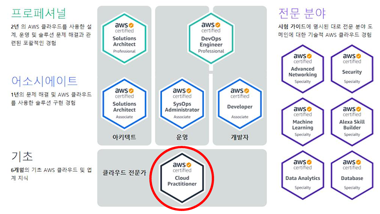

# AWS Certified Cloud

AWS Free Tier 에 관한 정보는

http://aws.amazon.com/free

[https://aws.amazon.com/ko/](https://aws.amazon.com/ko/)

AWS 계정생성 → insteady95@gmail.com → 

---

# 3. 클라우드 컴퓨터란?

## 3.7 기존 IT 개요

웹사이트는 어떻게 동작하는가? 호스팅 된 서버가 있고, 웹 브라우저에서 서버로 액세스 해서 웹사이트를 시각화 하는 것입니다. 클라이언트에서는 네트워크를 이용합니다. 클라이언트가 네트워크를 찾아 패킷을 라우팅하기 위해 데이터를 서버로 보내면 서버가 클라이언트에 응답하고 응답을 얻으면 웹사이트를 볼 수 있는 것입니다. 

클라이언트가 서버를 찾고, 서버가 클라이언트를 찾으려면 IP주소가 있어야 합니다. 

---

15시간

---

안녕하십니까, AWS Certified Cloud Practitioner 강좌에 오신 것을 환영합니다. 저는 강사인  Stéphane Marek입니다. 강의는 5분 후에 시작할 것인데, 부디 집중하여 주시기를 바랍니다. 우리는 Cloud Practitioner 시험에 대비할 것입니다. 이 시험의 일련번호는 CLF-C02입니다. 이 자격은 취득하기 어려우므로, 강좌가 길지만 흥미로울 것입니다. 기초적인 IT 지식을 가지고 계시면 도움이 됩니다. 하지만 IT 계열에 속하지 않으시더라도 걱정하실 필요 없습니다. 모든 내용은 설명을 드릴 것입니다. 이 강좌에서는 많은 내용을 배울 것입니다. AWS에 존재하는 200가지 이상의 서비스 중에 40개 이상을 다룰 예정입니다. IT와 AWS가 처음이시라면, 걱정하지 마십시오. 저는 여러분을 환영하며, 여러분은 아주 많은 것을 배우시게 될 것입니다.

천천히 들으셔도 됩니다. 지금은 경쟁을 하는 것이 아닙니다. 매일 조금씩 하다 보면 많이 배우실 것입니다. 또한, 이 강좌는 약간 특별합니다. 왜냐하면 저는 여러분께서 직접 실습을 하시면서 배우시기를 바라기 때문입니다. 이 강좌에 핵심적인 학습 방법입니다. 즉, 이 강좌는 이론 수업과 필요할 시에 실습을 혼합하여 제가 수업하는 내용을 따라 하시는 것입니다. 여러분의 AWS 계정을 생성하고 제가 화면에서 하는 행동을 따라하십시오. 우리는 자격증을 취득하고자 하는 것이기 때문에 시험에서 보게 될 문제 유형들을 보여드리고 싶습니다.

이것은 시험의 예시 문항입니다. '이 중 어느 AWS 서비스가 AWS로의 데이터베이스 이전을 단순화하는가?' 선지는 4개입니다. Storage Gateway, Database Migration Service, EC2, 그리고 Amazon AppStream 2.0입니다. 이 서비스 중 대부분은 강좌에서 배울 것입니다. 예를 들어 첫 번째는 강좌에서 배울 것입니다. 두 번째는 이름에서 뻔히 보이듯이 문제의 정답입니다. 정답(AWS Database Migration Service) 역시 다루게 될 서비스입니다. EC2 역시 배울 것입니다.

또한 강좌에 있는 서비스 중에는 '함정'이라 부를 서비스도 나올 수 있지만 이 강좌에서 다루지 않을 것입니다. AWS에는 200개 이상이나 되는 서비스가 있기 때문입니다. 그것들은 시험에 보통 오답 선지로 등장할 것입니다. 이 강좌에서는 AWS의 핵심이 되며 시험에 나올 서비스에 집중하고 싶습니다. 함정은 집중하여 설명하지 않을 것입니다. 다 설명하자면 여러분에게 정보를 과다하게 전달하게 될 것입니다.

시험의 예시 문제를 한번 보고 싶으시다면 이 링크로 가시면 됩니다. 이제 저에 대하여 약간 소개를 하겠습니다. 저의 이름은 Stéphane Marek입니다. 이 강좌에서 여러분을 가르칠 것입니다. 저는 11개의 AWS 자격증을 모두 가지고 있습니다. 또한 AWS 작업을 수 년간 해 왔습니다. 웹사이트, 애플리케이션, 스트리밍 플랫폼 등등을 구축하였습니다. 유데미에서는 거의 7년 동안 AWS 자격증 또는 서비스에 대한 수업을 하였습니다. 예를 들어 CloudFormation, Lambda, EC2와 같은 주제를 다뤘습니다. 보이시듯이 저의 강좌를 들은 수강자는 2백만 명 이상입니다. 그리고 수강자 모두 강좌에 큰 도움을 받았습니다. 여러분께서 저의 지도를 받기로 하셔서 정말로 기쁩니다.

저와는 SNS에서 소통하실 수도 있습니다. 저는 LinkedIn, Instagram, Medium, Twitter(X) 그리고 GitHub에서 팔로우하실 수 있으며, 여기 제 프로필 링크가 있습니다. AWS에 오신 것을 환영합니다. 여러분은 자격증을 취득하게 될 것입니다. 여러분께서 얻으실 자격은 AWS에서 첫 번째인 Foundational Certification for AWS Cloud Practitioner입니다. 첫 자격증으로 아주 좋지만, 동시에 수준이 꽤 높습니다. 지식을 더욱 늘리고 AWS의 기술적인 면을 더 알아보고 싶으시다면 이 강좌를 끝내신 후에 Associate 자격증에 도전하는 것을 추천합니다. 그 다음 AWS가 너무 마음에 들어 더더욱 많이 배우고 싶으시다면 Specialty와 Professional 시험들은 아주 고난도이며 깊이 있는 지식을 요구합니다.

이 강좌에서는 AWS Certified Cloud Practitioner 시험을 여유롭게 통과할 정도만의 내용을 배울 것입니다. 마지막으로, 이 강좌에는 실습이 있다고 아까 말씀드렸습니다. 그러면 이런 생각이 떠오르실 것입니다. 실습 비용은 얼마나 들 것인가? 강좌를 끝까지 수강하시는 데 드는 비용은 12.70달러입니다. 하지만 말씀드릴 점은 강좌에서 사용할 대부분의 서비스는 AWS Free Tier(프리 티어)에 포함될 것입니다. 그러므로 추가 비용이 들지 않을 수도 있습니다. 만약 제가 강좌 도중에 유료 서비스를 사용한다면 유료라는 것을 언급하여 여러분께 실습을 하지 않고 강의만 시청할 수 있는 선택지를 드리겠습니다. 예를 들어 가장 돈이 많이 드는 항목인 Registrar인데, 도메인 이름을 구매하였기 때문입니다. 저는 stephanccp.com과 같은 URL을 샀습니다.

Free Tier(프리 티어)에 대한 자세한 내용은 이 URL에 있습니다.

[https://aws.amazon.com/ko/free/](https://aws.amazon.com/ko/free/)

만약 무언가가 비용이 들지 안 들지 잘 모르시겠다면 참고하십시오. 아니면 이 슬라이드로 돌아오셔서 그 당시 다루고 있는 서비스 이름을 보고 무료인지 유료인지 보시면 됩니다. 말씀드렸듯이 사용할 대부분의 서비스는 Free Tier(프리 티어)에 포함되어 있기 때문에 제가 도와드릴 것이기 때문에 걱정하실 필요가 없습니다. 여러분께서 이 강좌로 저와 함께하는 것이 저는 정말 기쁩니다. 즐겁게 배우시기를 바랍니다.

---

자 AWS 계정을 함께 생성해봅시다. 먼저 루트 사용자 이메일 주소, 즉 주 이메일을 입력합니다. Amazon 계정에 로그인하는 데 사용될 거예요. 이제 계정 이름을 설정합니다. 저는 stephane-demo-v3로 할게요. 계정 검증을 마쳤으면 루트 사용자 비밀번호를 설정하고 다시 한번 확인하세요. 루트 비밀번호를 잊어버린다면 이메일을 통해 복구할 수는 있지만 이메일 주소와 루트 사용자 비밀번호를 잊지 않는 것이 가장 좋겠죠. 개인용 계정을 선택한 뒤 계정 세부 사항을 입력합니다. 다음으로 신용카드 정보를 입력하면 $1 결제 시도가 이루어질 텐데 실제로는 돈이 나가지 않고 신용카드 정보가 확인되고 나면 결제가 취소될 겁니다. 프리 티어에 있는 한 비용이 발생하지 않아요. 하지만 프리 티어 이상을 사용하면 비용이 청구됩니다. 모니터링하는 법도 가르쳐 드리겠지만 강의만 잘 따라오신다면 프리 티어를 벗어나지 않을 거예요. 나아가 신원을 확인하기 위해 핸드폰 번호를 입력하고 문자나 전화로 번호를 확인합니다. 지원 플랜으로는 Basic support - Free면 충분합니다. 자 AWS 가입에 성공하셨습니다. 계정이 활성화되기까지 몇 분만 기다리면 이메일로 알림이 올 거예요. 이제 아래 버튼을 클릭해 들어가서 루트 이메일 주소와 비밀번호를 입력해 AWS 콘솔에 로그인하세요. 좋습니다 강의를 본격적으로 시작해봅시다.

---

강의의 첫 섹션에 오신 것을 환영합니다. 클라우드와 클라우드 컴퓨팅을 소개하도록 하겠습니다. 그래서 실습은 진행하지 않고 이론만 살펴보지만 클라우드가 유용한 이유와 원리에 관해 이해하시길 바랍니다. 기초로 돌아가 보죠 웹사이트의 원리는 무엇인가요? 호스팅된 서버가 있고 웹 브라우저에서 서버로 액세스해서 웹사이트를 시각화하는 것입니다. 그래서 클라이언트에서는 네트워크를 사용합니다. 네트워크는 클라이언트와 서버 사이에 있고 클라이언트가 네트워크를 찾아 패킷을 라우팅하기 위해 네트워크를 사용해서 데이터를 서버에 보내면 서버가 클라이언트에 응답하고 응답을 얻으면 웹사이트를 볼 수 있는 것입니다. 간단하게 설명했지만 개념은 이해가 될 거예요.

클라이언트가 서버를 찾고 서버가 클라이언트를 찾으려면 IP 주소가 있어야 합니다. 그래서 클라이언트에 IP 주소가 있고 서버에도 IP 주소가 있죠. 따라서 여러분이 IP 주소를 사용해 원하는 서버로 요청을 보낼 수 있고 서버는 여러분을 찾는 방법을 알게 됩니다. 마치 여러분이 친구에게 편지를 쓰는 것과 같죠. 여러분이 편지를 쓴다면 그것이 데이터가 되고 여러분은 클라이언트가 됩니다. 그리고 편지를 보낼 때 우편함에 편지를 넣으면 네트워크는 우체국의 네트워크가 됩니다. 그러면 우체국은 네트워크와 편지에 적은 주소를 이용해 이 경우에는 서버인 편지의 목적지로 라우팅하고 받는 사람이 답장을 할 경우 봉투 뒷면에 적은 주소를 사용해서 답장을 하고 동일한 네트워크를 통해 여러분에게 편지가 도착합니다. 그래서 서버는 편지의 네트워크 같은 것이죠. 비유가 괜찮았길 바랍니다.

서버에는 무엇이 있을까요? 서버에는 CPU가 있고 CPU는 몇 가지 계산을 실행하는 작은 조각으로 계산을 하고 결과를 찾는데 매우 유용합니다. 또한 서버는 RAM 또는 메모리가 필요합니다. 아주 빠른 메모리가 필요하고 정보를 저장하고 빨리 검색할 수 있도록 합니다. 그러면 CPU와 메모리로 무엇을 얻을 수 있을까요? 두뇌를 얻을 수 있습니다 여러분의 두뇌를 생각해 보세요. 생각을 하는 것은 실제로 계산을 하는 것입니다 정말 복잡하지만 계산을 하는 것이죠. 그뿐 아니라 몇몇의 정보는 유지해야 하는데요. 다시 말하면 우리는 기억을 가지고 있고 이 기억은 두뇌에 있는 것이죠. 그래서 CPU와 RAM을 함께 생각해 보면 두뇌와 비슷합니다. 또한 장기 저장하는 데이터도 필요합니다. 인간 두뇌에도 있지만 컴퓨터에서는 파일과 같은 데이터를 저장하는 특별한 저장소가 있습니다. 그래서 더 구조적인 방법으로 데이터를 저장하려면 데이터베이스를 사용하고 데이터베이스는 데이터를 쉽게 검색하고 쿼리가 가능한 형식의 데이터가 될 것입니다.

마지막으로 서버에는 몇 가지 네트워킹 측면이 있습니다. 라우터, 스위치, DNS 서버가 있죠. 용어는 아직 몰라도 됩니다. 강의를 진행하면서 확인할 것입니다.

그래서 서버에는 컴퓨팅과 메모리, 스토리지 측면이 있고 서버는 데이터베이스일 수 있고 네트워킹 측면이 있습니다.

앞으로 이 모든 것은 매우 중요한데요 클라우드에서 이런 것들을 온디맨드로 제공하기 때문입니다.

그래서 강의를 시작하기 전에 IT 용어를 약간 정의하자면 네트워크는 서로 연결될 케이블과 라우터 그리고 서버의 묶음이며 라우터는 컴퓨터 네트워크 간의 데이터 패킷을 전달하는 특정 기기로 우편배달 서비스와 마찬가지로 인터넷에서 패킷을 어디로 보낼지 파악합니다. 이제 패킷이 목적지에 도착하면 스위치가 있습니다 스위치는 패킷을 네트워크의 정확한 클라이언트에 보냅니다.

이제 모든 것을 합쳐 보면 이런 모습입니다 클라이언트가 데이터를 라우터에 보내면 라우터는 스위치에 도달하는 방법을 찾고 네트워크에 있는 어떤 컴퓨터로 데이터를 보낼지 파악합니다. 이런 것을 왜 알려드릴까요? 기존의 IT로 돌아가 보겠습니다.

예전에 사람들이 웹사이트나 회사를 시작할 때는 집이나 차고에서 시작했습니다 말 그대로 가게에 가서 서버를 사서 집에 서버를 설치했죠. TV 프로그램에서 봤거나 Google 설립에 관한 문서를 인터넷에서 읽었을 수도 있습니다 Google은 차고에서 시작했습니다. 웹사이트가 점점 커지면 더 많은 서버가 필요합니다 그러면 집이 서버로 가득 차게 되겠죠 그래서 회사는 점점 커지고 있고 수입도 생기고 있으니 사무실로 이사를 가기로 합니다 그리고 데이터 센터라고 하는 특별한 공간을 할당하기로 했습니다 데이터 센터에는 서버가 있고 더 많은 서버를 추가하거나 구매해서 확장할 수 있습니다 그리고 몇 년 동안은 잘 운영됐습니다. 하지만 이 방식에는 몇 가지 문제가 있습니다 첫 번째는 데이터 센터나 또는 집에 서버를 보관하면 임대료를 지불해야 하고 전원 장치를 추가하고 쿨링 시키고 유지 보수해야 합니다. 서버를 실행하는데 전력이 필요하기 때문이고 서버가 뜨거워지므로 쿨링도 필요하죠 또 고장 날 때고 있기 때문에 유지 보수할 인원도 필요합니다. 그리고 무엇보다 서버를 추가하거나 교체하려면 시간이 오래 걸립니다 서버를 주문해야 하고 데이터 센터에 있는 서버와 연결해야 하기 때문입니다 확장에도 한계가 있습니다 규모를 10배로 확장하려면 10배 더 많은 서버가 필요합니다 하지만 그럴 만한 시간과 공간이 없죠 그리고 문제 발생에 대비해 인프라를 24시간으로 매일 모니터링할 팀도 채용해야 합니다 재난이 발생하거나 지진이 발생할 수도 있고 정전이나 화재가 발생할 수도 있습니다 정말 안 좋은 상황입니다 그럼 모든 것을 외부화할 수 있을까요? 외부화할 수 있습니다 그것이 바로 클라우드입니다 다음 강의에서 클라우드에 관해 더 자세히 살펴보겠습니다.

---

라우팅은 네트워크에서 데이터 패킷이 출발지에서 목적지로 이동하는 경로를 결정하는 과정입니다. 이 과정은 라우터나 스위치와 같은 네트워크 장비가 수행합니다.

간단히 말해서, 라우터는 데이터 패킷의 목적지 주소를 살펴보고 해당 패킷을 전달해야 하는 다음 장비나 네트워크로 패킷을 보내는 역할을 합니다. 이 과정에서 가장 효율적인 경로를 선택하여 패킷이 목적지에 빠르고 정확하게 도달할 수 있도록 합니다.

따라서 라우팅은 데이터의 효율적인 전송을 보장하고 네트워크의 트래픽을 관리하는 데 중요한 역할을 합니다. 개발자는 라우팅 알고리즘 및 네트워크 구성을 이해하여 애플리케이션의 성능을 최적화하고 네트워크 트래픽을 관리할 수 있어야 합니다.

---

온디맨드

온디맨드(On-demand)는 필요할 때 즉시 이용할 수 있는 서비스 또는 리소스를 의미합니다. 이는 사용자가 필요한 경우에만 서비스나 리소스를 요청하고 지불하는 모델을 말합니다.

예를 들어, 클라우드 컴퓨팅에서 온디맨드 서비스는 사용자가 필요로 하는 컴퓨팅 리소스(가상 서버, 스토리지, 네트워크 등)를 필요한 만큼 요청하고 사용한 만큼 비용을 지불하는 형태를 가집니다. 이는 사용자가 서버나 리소스를 미리 예약하거나 소유할 필요 없이 필요한 시점에 필요한 만큼 이용할 수 있게 해줍니다.

개발자는 온디맨드 모델을 통해 유연성과 비용 효율성을 얻을 수 있으며, 필요한 리소스를 즉시 확보하여 애플리케이션을 확장하거나 변경할 수 있습니다. 이는 클라우드 서비스를 통해 신속하고 효율적으로 개발 및 운영할 수 있는 환경을 제공합니다.

---

클라우드 컴퓨팅을 살펴보겠습니다.
클라우드 컴퓨팅은 무엇일까요? 정의는 다음과 같습니다.
클라우드 컴퓨팅은 컴퓨팅 성능과 데이터베이스 스토리지, 애플리케이션과 다른 IT 리소스를 온디맨드로 제공하는 것입니다. 여기서 핵심은 온디맨드입니다. 필요할 때 얻는 것이죠. 

그리고 클라우드 서비스 플랫폼으로 종량제 요금을 이용할 수 있습니다. 이는 요청할 때 요청한 만큼만 비용을 지불하는 것으로 사용이 끝나면 비용을 지불하지 않습니다. 정말 큰 변화죠? 이것이 바로 클라우드 컴퓨팅입니다.

그래서 필요한 컴퓨팅 리소스의 정확한 유형과 크기를 프로비저닝 할 수 있습니다. 큰 서버가 필요하면 사용할 수 있고 작은 서버가 필요해도 사용할 수 있죠. 서버 10개도 가능하고 내일 당장 사용할 수도 있습니다. 클라우드에서는 필요한 유형과 크기로 조정할 수 있도록 합니다. 그리고 모든 리소스에 액세스할 수 있습니다. 24시간이나 2시간 전에 통보하는 것이 아니라 바로 액세스할 수 있죠. 미리 주문하지 않아도 됩니다. 서버가 필요하면 강의에서도 보겠지만 몇 초 안에 사용할 수 있습니다. 또한, 클라우드는 훌륭한 인터페이스를 제공해 서버, 스토리지, 데이터베이스, 그리고 일련의 애플리케이션 서비스에 쉽게 액세스할 수 있습니다. 클라우드에 관한 것이지만 Amazon Web Services인 특정 AWS는 웹 애플리케이션을 통해 필요한 것을 프로비저닝하고 사용하는 동안 이런 애플리케이션 서비스를 위한 네트워크로 연결된 하드웨어를 소유하며 유지하고 있습니다. 그래서 이 인터페이스로 모든 것을 실제로 만들 수 있죠. 

다시 기존 IT로 돌아가 보겠습니다. 이제 상황이 변했습니다. 사무실 또는 차고가 있지만 자체 데이터 센터를 짓는 대신 클라우드를 사용합니다. 클라우드는 자체 데이터 센터는 아니지만 데이터 센터이며 서버는 3대가 필요하고 사용한 만큼만 지불할 것입니다. 그리고 여러분도 모르게 서버를 사용해 왔습니다. 클라우드는 어디에나 존재하지만 반드시 보일 필요는 없기 때문이죠. 그래서 Gmail과 같은 웹 클라이언트를 사용하면 예를 들어 이메일 클라우드 서비스에서는 저장한 이메일에 관해서만 요금을 지불합니다. 서버도 프로비저닝 하지 않고 Gmail을 사용하면 그냥 사용하면 되죠. 데이터를 클라우드에 저장했을 수도 있습니다. Dropbox, Google Drive Google Photos 또는 iCloud에 말이죠. Dropbox를 예로 들면 클라우드 스토리지 서비스로 Dropbox에 파일을 업로드합니다. 그리고 재밌는 사실은 Dropbox가 AWS로 설계됐다는 것입니다. 그래서 모르는 사이에 클라우드 서비스를 사용해 온 것이죠. Netflix는 아주 거대합니다. 전체가 AWS로 설계됐고 맞춤 영상 정보 서비스를 이용할 수 있는 클라우드 서비스를 제공합니다. 이런 클라우드 서비스는 AWS와 많이 다르지만 앞으로 이런 서비스의 이면과 이런 유형의 클라우드 서비스 설계에 AWS를 어떻게 활용하는지 살펴봅니다.

한 단계 더 나아가 볼까요? 클라우드의 유형은 다양합니다. 첫 번째는 사설 클라우드로 제공 업체는 Rackspace입니다. 단일 조직에서 사용하는 클라우드 서비스로 외부에 노출되지 않아서 자체 사설 클라우드와 자체 사설 데이터 센터를 가지며 다른 사람이 관리하지만 여러분이 완전히 제어할 수 있고 특정 사업에서 요구되는 민감한 애플리케이션을 위해 강화된 보안이 제공됩니다. 강의 내용 밖이지만 알아 두면 좋습니다. 

공용 클라우드는 더 흥미롭습니다. 공용 클라우드의 유명한 제공 업체는 3군데가 있습니다. MS Azure, Google Cloud, 그리고 AWS이며 이 강의에서 다룰 예정입니다. 공용 클라우드는 타사 클라우드 서비스 제공 업체가 클라우드 리소스를 소유하고 운영하고 인터넷을 통해 제공합니다.

그리고 클라우드 컴퓨팅 사용의 6가지 장점도 살펴보겠습니다. 이 경우에는 AWS에서 원하는 때에 필요한 것을 요청할 수 있습니다.

마지막은 시험에도 중요한 바로 하이브리드 클라우드의 개념입니다. 하이브리드는 사설, 공용 클라우드를 결합한 것입니다. 일부 서버를 온프레미스에 유지하고 필요한 기능의 일부를 클라우드로 확장합니다. 자체 인프라와 AWS의 클라우드의 하이브리드를 의미하는 것입니다. 사설 클라우드에 있는 민감한 정보는 제어하면서 공용 클라우드를 사용해서 유연함과 비용 효율성을 가지는 것입니다. 

클라우드 컴퓨팅의 5가지 특징을 살펴보겠습니다.

첫 번째는 완전한 온디맨드이며 셀프서비스인 것입니다. 강의에서 살펴보겠지만 사용자는 리소스를 프로비저닝 할 수 있고 AWS의 개입 없이 사용할 수 있습니다.

또한, 광역 네트워크에 액세스할 수 있으며 네트워크를 통해 리소스를 사용할 수 있고 다양한 방법으로 액세스할 수 있는데 이 강의에서 살펴보겠습니다.

멀티 테넌시가 될 것이며 리소스 풀링이 가능합니다. 이는 여러분뿐만 아니라 AWS의 다른 고객도 동일한 인프라와 애플리케이션을 공유하면서도 보안과 프라이버시를 유지할 수 있습니다. 그리고 많은 고객은 동일한 물리적 리소스로 서비스를 받게 됩니다. 저와 여러분과 다른 고객이 클라우드의 전체 데이터 센터를 공유하는 것입니다.

그리고 빠른 탄력성과 확장성도 제공합니다. 필요할 때 자동으로 그리고 신속하게 원하는 리소스를 획득하고 처리할 수 있는 것이며 온디맨드 기반으로 쉽고 빠르게 확장할 수 있다는 의미입니다. 클라우드의 가장 큰 장점이죠.

마지막은 측정 가능한 서비스라는 것입니다. 사용량을 측정해서 정확히 사용한 만큼 지불하는 것입니다. 온프레미스에서 가장 크게 바뀐 점입니다.

이제 6개의 장점을 살펴보죠.

자본적 지출을 업무 지출로 교환할 수 있습니다. CAPEX를 OPEX로 교환하는 것이죠. 이는 하드웨어를 소유하지 않고 온디맨드로 지불하는 것이며 총 소유 비용인 TCO와 업무 지출을 절감할 수 있습니다. 이는 하드웨어를 미리 구매할 필요 없이 AWS에서 임대하면 된다는 뜻입니다.

그리고 거대한 규모의 경제로부터 혜택을 얻을 수 있습니다. 우리뿐만 아니라 다른 고객과 많은 사람들이 AWS를 사용하기 때문에 시간이 지남에 따라 AWS 가격이 인하됩니다. AWS는 규모가 크기 때문에 실행하는데 더 효율적이기 때문입니다.

그리고 용량을 짐작할 필요가 없습니다. 이전에는 서버를 미리 구매하고 용량이 맞기를 바랐다면 지금은 애플리케이션의 실제 측정된 사용량을 기반으로 자동으로 확장할 수 있습니다. 전부 온디맨드이기 때문입니다.

또한, 속도와 민첩성이 향상됩니다. 바로 무언가 생성하고 운영할 수 있으며 효율을 방해하는 것이 없죠.

데이터 센터의 운영 및 관리하는 막대한 비용을 더 이상 지불하지 않아도 됩니다.

그리고 다섯 명의 팀원이 글로벌 애플리케이션을 몇 분 안에 생성할 수도 있습니다. 이는 전 세계로 확장될 AWS 글로벌 인프라를 활용하면 가능합니다.

클라우드를 사용해 해결할 수 있는 문제는 조금 더 융통성을 가질 수 있고 비용 효율적일 수 있으며 확장 가능하다는 것입니다. 필요시 리소스를 추가하기 때문이죠. 탄력성을 가져 필요할 때 스케일 인과 스케일 아웃 할 수 있습니다. 또한 고가용성과 내결함성을 가집니다. 데이터 센터가 필요 없고 전 세계의 데이터 센터에 의존할 수 있습니다. 민첩성도 향상됩니다 소프트웨어 애플리케이션을 빠르게 개발하고 출시할 수 있습니다. 그러면 클라우드가 정말 간단해지지만요. 지금까지 클라우드의 효율성을 소개해 드렸습니다. 다음 강의에서는 한 단계 더 나아가 다양한 클라우드 컴퓨팅 유형을 살펴보겠습니다.

---

프로비저닝은 클라우드 컴퓨팅에서 리소스를 사용할 수 있도록 사전에 설정하고 준비하는 과정을 말합니다. 이는 서버, 스토리지, 네트워크 등의 IT 리소스를 필요에 맞게 할당하고 설정하는 것을 포함합니다. 이 과정을 통해 사용자는 필요한 리소스를 더 빠르게 얻을 수 있고, 확장이나 축소하는 데 필요한 시간과 비용을 절약할 수 있습니다.

---

온프레미스는 조직이 자체적으로 서버, 네트워크, 데이터 센터 등을 구축하고 운영하는 것을 의미합니다. 즉, 기업이 자체적으로 IT 인프라를 보유하고 운영하는 것을 말합니다. 이는 클라우드 컴퓨팅과 대비되며, 보안과 컨트롤에 대한 높은 수준의 직접적인 관리를 제공할 수 있지만, 하드웨어 및 소프트웨어의 구매, 유지 보수 및 업그레이드에 대한 비용과 시간이 많이 소요될 수 있습니다.

---

멀티 테넌시는 하나의 소프트웨어 시스템이 여러 사용자 또는 "테넌트"에게 서비스를 제공하는 데 사용되는 아키텍처 디자인입니다. 이는 다수의 사용자가 동일한 시스템 또는 애플리케이션을 동시에 사용할 수 있도록 하는 것을 의미합니다. 각 테넌트는 자체 데이터와 설정을 가질 수 있지만, 하나의 시스템을 공유하여 리소스를 효율적으로 활용할 수 있습니다. 멀티 테넌트 아키텍처는 클라우드 컴퓨팅에서 흔히 사용되며, 리소스 공유와 효율성을 향상시키고 비용을 절감하는 데 도움이 됩니다.

"테넌시"는 "임차권"이나 "임대"를 의미합니다. 따라서 멀티 테넌시는 여러 사용자 또는 조직이 하나의 소프트웨어 또는 시스템을 "임차"하여 사용하는 것을 나타냅니다.

---

풀링은 리소스를 함께 사용하거나 모으는 것을 의미합니다. 클라우드 컴퓨팅에서 리소스 풀링은 다양한 사용자 또는 애플리케이션이 하나의 물리적 리소스 또는 가상 리소스를 공유하여 사용할 수 있게 합니다. 이것은 리소스의 효율성과 활용도를 높이며, 필요할 때 리소스를 동적으로 할당하고 관리할 수 있도록 해줍니다. 예를 들어, 여러 사용자가 하나의 서버를 공유하여 사용하는 것이 리소스 풀링의 한 예입니다.

---

Capex는 "자본 지출"을 의미하며, 기업이 장비나 시설과 같은 장기적인 자산을 구매하거나 투자할 때 발생하는 비용을 가리킵니다. 예를 들어, 데이터 센터를 구축하거나 서버를 구매하는 것은 Capex에 해당합니다.

Opex는 "운영 비용"을 의미하며, 기업이 일상적인 비용으로서 비즈니스 운영에 필요한 비용을 지출할 때 발생합니다. 클라우드 서비스나 소프트웨어 구독료와 같은 서비스 요금이 Opex에 해당합니다. Opex는 일반적으로 사용한 만큼 지불하므로 초기 투자가 필요하지 않고 유연한 비용 구조를 제공합니다.

---

# 9. 다양한 유형의 클라우드 컴퓨팅

클라우드 컴퓨팅의 다양한 유형을 살펴보겠습니다. 그리고 유형을 인지하는 것이 매우 중요합니다.

첫 번째는 IaaS인 서비스형 인프라입니다. 클라우드 IT에 관한 구성 요소를 제공합니다. 네트워킹, 컴퓨터 또는 데이터 스토리지 공간을 제공할 수 있습니다. 이러한 블록으로 레고를 조립하듯이 높은 유연성도 가집니다. 기존 온프레미스 IT에서 클라우드로 이동한 방법을 생각하면 이해가 더 쉬울 것입니다. 이것이 이 강의에서 살펴볼 첫 번째 서비스이며 내용도 어렵지 않을 것입니다.

두 번째는 서비스형 플랫폼인 PaaS입니다. 여기서는 기본 인프라를 관리할 필요가 없습니다. 배포와 애플리케이션 관리에만 집중할 수 있습니다.

더 나아가 서비스형 소프트웨어인 SaaS가 있습니다. 서비스 제공 업체가 완전히 운영하고 관리하는 것입니다.

예시로 이 3가지 유형을 비교해 보겠습니다. 온프레미스에서 전체를 관리합니다. 애플리케이션, 데이터, 런타임, 미들웨어뿐만 아니라 운영체제, 가상화, 서버, 스토리지 그리고 네트워킹 등 많은 것을 관리하죠.

서비스형 인프라인 IaaS로는 애플리케이션, 데이터, 런타임 미들웨어, 운영체제를 관리하지만 가상화, 서버, 스토리지 그리고 네트워킹은 다른 서비스로 관리합니다. 이 경우에는 AWS로 관리하죠.

서비스형 플랫폼으로는 관리하는 것이 더 적습니다. 런타임부터 네트워킹까지 모두 AWS에서 관리합니다. 서비스형 플랫폼 사용 시 신경 써야 할 것은 애플리케이션과 데이터뿐입니다.

마지막으로 서비스형 소프트웨어를 사용하면 전부 AWS에서 관리합니다.

이것은 어떤 의미일까요? IaaS로는 AWS에서 Amazon EC2를 사용할 수 있는데 Google Cloud Platform(GCP)과 Azure, Rackspace, Digital Ocean Linode와 같은 서비스가 클라우드 컴퓨팅의 서비스형 인프라로 제공됩니다. 서비스형 플랫폼에도 AWS의 일래스틱 Beanstalk이 존재합니다. 이 강의에서 이런 서비스를 살펴보겠습니다. AWS 외에도 Heroku, Google App Engine, Windows Azure가 있습니다. 소프트형 서비스도 많은 서비스가 있는 AWS에서 사용할 수 있습니다. 예를 들면, 머신 러닝 작업 시 Rekognition을 사용할 수 있습니다. 하지만 실제로는 Gmail과 Dropbox를 사용하고 회의를 위한 Zoom 등 Google 앱을 사용하죠.

이렇게 다양한 유형의 클라우드가 있고 한 가지 공통점이라면 가격이 생각하는 것과 많이 다르다는 것입니다. AWS에는 3가지의 기본 가격이 있고 모두 종량 과금제를 따르고 있습니다. 컴퓨팅에 관한 다양한 서비스는 컴퓨팅 시간에 따라 지불합니다. 스토리지는 클라우드에 저장한 양만큼 지불하죠. 그리고 네트워킹은 데이터가 클라우드에서 나갈 때만 지불합니다. 클라우드에 들어오는 모든 데이터는 무료입니다. 이는 기본 IT의 비싼 비용 문제를 해결합니다. 필요한 만큼만 지불해서 막대한 비용을 절감할 수 있기 때문입니다.

---

IaaS는 "Infrastructure as a Service"의 약자로, 개발자가 클라우드를 통해 기본적인 IT 인프라를 이용할 수 있는 서비스입니다. 이는 네트워킹, 컴퓨팅, 데이터 스토리지 등과 같은 기본적인 IT 자원을 클라우드 공급자가 제공하고 유지보수하는 것을 의미합니다. 개발자는 이러한 인프라 자원을 필요에 따라 확장하거나 축소하여 사용할 수 있으며, 이를 통해 애플리케이션을 보다 효율적으로 개발하고 운영할 수 있습니다. IaaS는 온프레미스 IT 환경에서의 하드웨어 구매 및 유지보수 비용을 줄이고, 빠르고 확장 가능한 인프라를 제공하여 개발자들이 더욱 효율적으로 작업할 수 있도록 도와줍니다.

---

# 10. AWS 클라우드 개요

이제 AWS 클라우드의 역사를 살펴봅시다. AWS 클라우드는 2002년에 [Amazon.com](http://amazon.com/) 내부에서 시작됐습니다. IT 부서도 외주가 가능하다는 것을 깨달았기 때문이죠. Amazon의 인프라는 그들의 핵심 역량 중 하나였고 '다른 사람들을 위해 IT 업무를 해보면 어떨까?'라는 아이디어를 가지게 됩니다. 그래서 2004년에 첫 번째 서비스인 SQS를 출시하게 되죠. 2006년에는 서비스를 확장하여 재출시했고 SQS, S3, EC2가 포함되었습니다. 이 서비스들은 모두 강의에서 다루게 될 테니 걱정 마세요. 그 후 추가 확장을 거치면서 미국에서만이 아니라 유럽에서도 서비스를 시작하게 됩니다. 이런 식으로 쭉 진행이 되어 오늘날 Dropbox, Netflix, Airbnb, 심지어는 NASA까지 매우 많은 애플리케이션이 AWS에서 운영되었거나 지금도 운영되고 있는 중이죠.

그럼 현재의 AWS는 어떤 모습일까요? 일종의 클라우드 공급자 순위인 Gartner Magic Quadrants를 보면 AWS가 맨 우측 상단에 있죠. 즉, 선두라는 뜻입니다. 굉장히 성공적인 사업을 이끌었으며 매우 높은 완성도와 혜안을 가지고 있죠. 다음으로 Microsoft와 Google이 그 뒤를 따릅니다. 하지만 여전히 AWS는 2019년에도 여전히 350억 달러라는 막대한 매출을 달성했고 시장 점유율도 47%에 달했습니다. 2등인 Microsoft의 시장 점유율은 22%에 불과했죠. 따라서 AWS를 배움으로써, 이처럼 널리 사용되는 도구를 배우시게 되는 거죠. AWS는 클라우드 시장의 개척자였고 9년 연속으로 선두를 지키고 있습니다. 그리고 백만 명이 넘는 사용자가 활동 중이죠.

그러면 AWS에서는 뭘 할 수 있을까요? 거의 모든 것이 가능합니다. AWS를 통해 복잡하고 확장 가능한 애플리케이션을 만들 수 있죠. 다양한 산업 분야에 적용할 수 있습니다. 모든 회사들이 클라우드를 사용합니다. Netflix, McDonald's 21st Century Fox, Activision 등 모두 클라우드를 사용하고 있죠. 기업의 IT를 이전하거나 백업과 스토리지를 위해 클라우드를 사용하거나 빅 데이터 분석을 할 수도 있죠. 또한 웹사이트를 호스팅하거나 모바일 또는 소셜 애플리케이션에 대한 백엔드를 만들 수도 있습니다. 게임 서버 전체가 클라우드에서 실행되도록 할 수도 있죠. 적용 분야는 무궁무진합니다. 그리고 AWS는 글로벌합니다.

어떻게 작동하는지 좀 더 자세히 배워봅시다. 먼저 AWS 리전이 있고 가용 영역, 데이터 센터 엣지 로케이션, 전송 지점이 있죠. 이 지도를 보시면 모든 내용이 잘 나와 있습니다. 이 웹사이트로 이동해서 잠깐 살펴봅시다. 멋지지 않나요? 이 웹사이트를 통해 AWS가 얼마나 글로벌한지를 알 수 있습니다. 여길 클릭하면 세계를 둘러 보면서 무슨 일이 일어나고 있는지를 알 수 있죠. 보시는 것처럼, AWS는 전 세계에 걸쳐서 주황색으로 표시된 다수의 리전을 가지고 있습니다. 이처럼 AWS는 진정으로 글로벌한 서비스입니다. 뿐만 아니라 각각의 리전은 네트워크를 통해 연결됩니다. 이 선들이 리전을 연결하는 네트워크죠. AWS의 사설 네트워크입니다. 그리고 각각의 리전 내에 예를 들어 케이프타운 리전을 확대해 보면 파란 점들을 볼 수 있습니다. 각각의 파란 점들은 가용 영역인데 이 내용은 다음 슬라이드에서 설명드리죠. 이처럼 AWS가 엄청나게 글로벌하다는 점을 보여드리고 싶었습니다. 그리고 클라우드 공급자의 인프라를 활용하여, 우리 자신 및 우리의 애플리케이션도 글로벌하게 만들 수 있는 거죠.

AWS에서 첫 번째로 중요한 개념은 리전입니다. 리전은 전 세계에 걸쳐 있고 방금 지도를 통해 직접 살펴봤죠. 리전에는 이름이 있습니다. us-east-1 또는 eu-west-3 같은 것들이죠. 잠시 후에 배우게 될 콘솔에서 리전의 이름과 그에 해당하는 코드의 매핑을 확인해 볼 겁니다. 그럼 리전이란 뭘까요? 바로 데이터 센터의 집합입니다. 다양한 데이터 센터들이 있죠. 예를 들어, 여기를 보시면 오하이오, 싱가포르 시드니, 도쿄 등이 있습니다. AWS 서비스를 사용할 때 대부분의 서비스들은 특정 리전에 연결되어 국한됩니다. 즉, 한 리전에서 어떤 서비스를 사용하다 다른 리전에서 그 서비스를 사용하려고 하면, 서비스를 처음 사용하는 셈이 되는 거죠. AWS 리전을 어떻게 선택하는지 묻는 문제가 시험에 출제될 수도 있는데요.

새로운 애플리케이션을 출시하는 경우 어떤 리전을 선택하면 될까요? 미국, 유럽, 남아메리카, 호주 중 어디가 좋을까요? 정답은 당연히 '상황에 따라 다르다' 입니다만 AWS 리전 선택에 영향을 미칠 수 있는 몇 가지 요인들을 알아 봅시다. 첫 번째는 법률 준수입니다. 간혹 어떤 정부들은 애플리케이션을 배포하게 될 대상 국가 내에 데이터가 보관되기를 원합니다. 예를 들어, 프랑스의 데이터는 프랑스 내에 있어야 하는 것이죠. 이 경우에는 애플리케이션을 프랑스 리전에서 출시해야 할 겁니다.

다음 요인으로는 지연 시간이라는 개념이 있습니다. 만약 대부분의 사용자가 미국에 있는 경우 애플리케이션 역시 사용자와 가까이 있도록 미국에서 출시하는 것이 바람직하겠죠 그래야 지연 시간이 줄어들 테니까요. 미국 사용자들을 위한 애플리케이션을 호주에서 출시하면 사용자들이 애플리케이션을 사용할 때 심한 랙을 경험하게 될 겁니다. 다음으로, 모든 리전이 모든 서비스를 가지고 있지는 않습니다. 일부 리전에는 서비스가 없을 수 있죠. 따라서 애플리케이션에 특정 서비스를 활용 중이라면 그 애플리케이션을 출시하려는 리전에 해당 서비스가 있는지를 당연히 확인해야 할 겁니다. 마지막으로는 요금입니다. 리전마다 요금이 달라지죠. 리전 간 요금의 차이를 확인하려면 서비스 요금 페이지를 참고하시면 됩니다. 이 또한 당연히 특정 리전에 여러분의 애플리케이션을 출시할 때 영향을 미치는 요인이 되겠죠.

가용 영역은 리전 내에 존재합니다. 각각의 리전은 많은 가용 영역을 가지고 있겠죠. 보통은 세 개씩 있고 최소는 둘, 최대는 여섯 이지만 대부분은 세 개입니다. 예를 들어 시드니 리전을 봅시다. 시드니 리전의 코드는 ap-southeast-2입니다. 그리고 시드니 리전에는 세 개의 가용 영역이 있습니다. ap-southeast-2a, ap-southeast-2b 그리고 ap-southeast-2c죠. 각각의 가용 영역은 여분의 전원 네트워킹, 그리고 통신 기능을 갖춘 하나 또는 두 개의 개별적인 데이터 센터로 이루어져 있습니다. 즉 southeast-2a 내에 두 개의 데이터 센터가 있을 수 있고, 2b에도 두 개, 2c에도 두 개가 있을 수 있죠. 한 개, 세 개 네 개일 수도 있고 AWS가 공개하지 않아서 정확히 알 수 없죠. 하지만 한 가지 확실하게 알고 있는 점은 각각의 가용 영역들이 재난 발생에 대비해 서로 분리되어 있다는 겁니다. 만약 ap-southeast-2a에 문제가 생긴다고 해도 ap-southeast-2b나 ap-southeast-2c에는 영향을 미치지 않도록 설계되었음은 알고 있는 거죠. 재난에 대비해 서로 단절되어 있습니다.

이런 데이터 센터와 가용 영역들은 높은 대역폭의 초저지연 네트워킹으로 서로 연결되어 리전을 형성합니다. 다음으로는 글로벌 인프라로서의 AWS에 대해 꼭 알고 계셔야 할 점으로 전송 지점, 즉 엣지 로케이션이 있습니다. 이 강의의 글로벌 섹션에서 상세히 다룰 내용입니다만 AWS가 42개국 84개의 도시에 200개가 넘는 전송 지점을 가지고 있다는 것은 알아 두셔야 합니다. 이런 점으로 인해 최소 지연 시간으로 최종 사용자에게 컨텐츠를 전달하는 데에 아주 유용하죠. 이런 내용은 강의 과정 중에 다시 배우게 될 내용이니 이 부분도 빠르게 넘어가겠습니다. 마지막으로, 이 링크에서 확인 가능한 리전 테이블을 통해 여러분의 리전에서 특정 서비스가 제공되는지의 여부를 알 수 있죠.

그럼 이제 콘솔은 어떨까요?
AWS는 IAM, Route 53, CloudFront, 그리고 WAF 등의 글로벌 서비스를 제공하지만, Amazon EC2, Elastic Beanstalk, Lambda 그리고 Rekognition과 같은 대부분의 AWS 서비스들은 특정 리전에 국한됩니다.

마지막으로, 이 링크에서 확인 가능한 리전 테이블을 통해 여러분의 리전에서 특정 서비스가 제공되는지의 여부를 알 수 있죠.

---

# 11. AWS의 콘솔 및 서비스 둘러보기

AWS Console Home에서 강의를 시작해봅시다. 이 페이지에서 할 수 있는 게 아주 많아요. 우선 화면 오른쪽 상단을 보면 리전 선택기가 있습니다.

현재 US East (N. Virginia) us-east-1로 설정되어 있죠. 여러분에게 지리적으로 가장 가까운 리전을 선택하시는 게 좋아요. 저는 Ireland 근처에 있어서 eu-west-1을 선택하겠습니다. 그 외에 다른 리전 예를 들어 Africa의 Cape Town 근처에 계실 수도 있죠. 물론 실제로 해당 리전에 있어야만 리전을 선택할 수 있는 건 아닙니다. 가장 가깝다고 판단되는 리전을 선택하세요. 지연 시간이 줄어들 겁니다.

또 Console Home에는 최근 방문한 서비스 리스트가 있는데 여러분은 없는 게 당연합니다. 저는 한 번 들어가 본 서비스가 리스트에 나와 있네요. 그 아래에서는 AWS에 관한 정보가 있어요. 상태에 문제가 생긴다면 그 옆에 나타나고 계정 비용 및 이용 정보뿐만 아니라 해결책을 찾는 튜토리얼 등도 있습니다. 사실 시간에 따라 웹페이지가 많이 바뀔 거예요. 지난 2년만 보더라도 판이하게 바뀌었으니 여러분이 보시는 시점에는 또 다를 수도 있습니다. 차이가 너무 크게 난다면 그때 영상을 다시 찍도록 하겠습니다.

이제 AWS 서비스를 살펴볼게요. 두 가지 옵션이 있는데 그중 하나는 왼쪽 상단에서 Services를 클릭하면 알파벳 순서로 서비스를 볼 수 있습니다. 보시다시피 AWS에는 서비스가 아주 많죠. 혹은 COMPUTE 등 카테고리를 클릭하면 관련 서비스가 나열됩니다. 강의를 진행하면서 서비스들을 차차 배울 테니 일일이 들어가 보지는 않을게요. 

 외에 검색창이 아주 유용합니다. route 53 등의 서비스를 검색하면 검색 결과로 쿼리에 맞는 네 개의 서비스를 보여주네요. 아래 Features를 보면 서비스에 맞는 열세 가지 기능이 나오니 Route 53 서비스의 도메인 이름 기능을 바로 수행할 수 있죠. 매우 편하겠죠. 검색 시 블로그나 기사 및 공식 자료 등도 나와요. 좋습니다.

Route 53 서비스를 눌러 콘솔을 살펴볼까요. 오른쪽 상단에 Global이라고 나와 있다면 리전을 선택할 필요가 없다는 뜻입니다. 규칙이라기보다는 예외인 건데 AWS 서비스 중 몇 가지 글로벌 서비스가 있습니다. 어느 장소에서든 똑같은 화면을 보는 거죠. 하지만 EC2 등 다른 서비스에 들어가면 오른쪽 상단에 제가 고른 리전인 Ireland가 나옵니다. Ireland에서 콘솔을 실행할 때와 Canada 등의 리전을 선택해 콘솔을 실행할 때 화면에 보이는 리소스가 다를 거예요. 따라서 강의를 진행하는 내내 다른 리전으로 바꾸지 않는 것이 중요합니다. 그 외에 Google에 AWS Global Infrastructure를 검색해서 들어가보면 서비스에 관한 정보가 많이 나와요. AWS Regional Services에 들어가면 리전에 따른 서비스가 테이블로 정리되어있죠. 강의나 실습에서 다루는 서비스를 여러분 리전에서 찾을 수 없다면 이 페이지에서 사용 가능한지 확인해보세요. 예를 들어 Cape Town을 설정하면 해당 리전에서 사용 가능한 모든 서비스가 나오죠. 원하는 서비스를 찾을 수 없다면 콘솔에서 리전을 바꿔야 액세스가 가능해집니다. 이렇듯 AWS의 모든 서비스가 모든 리전에 있지는 않아요. 

---

# 12. 코스의 UI 변경 사항

안녕하세요, 제 영상과 AWS 화면 간 발생할 수 있는 UI의 차이에 대해 말씀드리겠습니다. 먼저 설명을 드리자면, AWS는 새로운 디자인 지침에 맞춰 대대적인 인터페이스 변경 중에 있습니다. 따라서 새로운 UI가 표시될 수 있습니다. 

이게 새로운 형태의 UI죠. 사각형 모양으로 되어 있습니다. 

그러나 오래된 UI가 보일 때도 있을 겁니다. 이런 형식이죠. AWS가 모든 서비스에 대한 UI 인터페이스를 변경 중에 있지만, 모든 변경이 동시에 진행되고 있지는 않습니다. 1, 2년에 걸쳐 진행될 것이고, 지금 이 순간에도 진행 중이죠. 물론 제 목표는 영상을 가급적 최신으로 유지하는 것이지만, AWS 측이 변경 작업을 마무리하기 전에는 모든 변경을 전부 반영하는 것이 불가능합니다. 따라서 급격한 변화에 대해서는 강의 영상들을 최대한 최신으로 유지하기 위해 노력 중이지만, 여러분이 콘솔을 사용하시는 데에 지장을 주지 않을 정도의 작은 변화는 영상에 업데이트 해서 반영하진 않고 있습니다. 하지만 저는 피드백을 귀담아 듣는 사람이고, 영상에 업데이트가 필요한 경우에는 바로 업데이트를 할 테니 걱정 마세요.

또 하나 말씀드리자면, 이런 차이에 심각하게 혼란을 느끼고 계신 경우 새 UI가 반영된 대부분의 서비스에서 이 스위치를 끔으로써 기존의 UI로 돌아갈 수 있습니다.

보시다시피 스위치를 꺼 기존 UI로 돌아가시면 가끔 제 영상에서와 같은 예전 UI를 보실 수 있습니다. 다만, 혹시 몰라서 미리 말씀드리는 것이지 제 강의가 뒤쳐져 있는 건 전혀 아닙니다. 여러분이 시험에 합격하고 이 강의를 통해 많은 것을 배우실 수 있도록 돕는 게 제 열정이자 의무죠. 저를 믿으셔도 좋습니다. 강의에 영향을 미칠 만큼 큰 변화가 있는지의 여부를 매일 확인하고 있으며, 강의에 중요한 변경 사항은 반드시 업데이트할 것을 약속드릴 테니 강의 상의 화면이 AWS 상의 변경을 즉각적으로 반영하지 못 한 경우가 있다 해도, 이해 부탁드립니다. 현 상황에서 모든 변화를 따라가기는 굉장히 어렵습니다. 감사합니다, 즐거운 시간이 되길 바랍니다.

---

# 13. 공동 책임 모델 및 AWS 허용 정책

강의를 시작하기 전에 한가지 정리하겠습니다. 공동 책임 모델에 대해 많은 언급이 있을 것입니다. 또한, 강의의 마지막에는 이 도표를 살펴보겠습니다.

클라우드를 사용할 때는 여러분의 책임과 AWS의 책임이 있습니다. 여러분은 고객으로서 클라우드 내 보안에 대한 책임이 있습니다. 클라우드에서 사용하고 구성하는 모든 것은 여러분의 책임입니다. 이에는 보안, 데이터, 운영체제, 네트워크, 방화벽 구성 등이 포함됩니다. 반면에, AWS는 클라우드에 관한 보안 책임이 있습니다. 이는 모든 인프라, 하드웨어, 소프트웨어, 자체 내부 보안을 포함합니다. 따라서 공동 책임이 발생합니다. Certified Cloud Practitioner 시험에서는 여러분의 책임과 AWS의 책임을 식별하는 문제가 출제됩니다.

이제 간략하게 설명했으니, 몇 개의 섹션에서 다시 도표와 모델을 사용하여 여러분의 책임과 AWS의 책임을 자세히 살펴보겠습니다. 마지막으로, AWS를 사용하기 전에 이용 목적 제한 방침에 동의해야 합니다. 이는 링크를 통해 확인할 수 있으며, 내용은 매우 이해하기 쉽습니다. 불법적이고 공격적이거나 유해한 사용이나 콘텐츠를 금지하며, 보안을 위반하거나 네트워크를 남용할 수 없습니다. 또한, 이메일이나 다른 유형의 메시지를 남용해서도 안 됩니다. 이는 잘 알려진 사항이지만, 명시하는 것이 중요합니다. 이제 강의를 시작하고 클라우드를 사용하는 것이 기쁘네요. 다음 강의에서 뵙겠습니다.

---

# Quiz

1. 오직 애플리케이션 및 데이터만 관리하려면 어떤 클라우드 컴퓨팅 모델을 사용해야 합니까?

---

# 14. IAM 소개: 사용자, 그룹, 정책

AWS 서비스를 본격적으로 다룰 첫 강의에 오신 것을 환영합니다. 첫 번째로 IAM입니다. IAM은 Identity and Access Management의 약자로, 사용자를 생성하고 그룹에 배치함으로써 글로벌 서비스에 해당합니다. 이미 우리는 IAM을 사용해왔습니다. 계정을 생성할 때 기본적으로 루트 계정이 생성됩니다. 이는 기본 생성 요소로서, 계정의 루트 사용자가 됩니다. 그러나 이는 계정을 생성할 때만 사용해야 합니다. 그 후에는 더 이상 사용하거나 공유해서는 안 됩니다. 대신에 사용자를 생성해야 합니다.

IAM에서 사용자를 생성할 때, 각 사용자는 조직 내 한 사람에 해당합니다. 필요한 경우 사용자들을 그룹으로 묶을 수도 있습니다. 예를 들어, 여섯 명으로 이루어진 조직이 있다고 합시다. Alice, Bob, Charles, David, Edward, Fred가 있으며, 이들 모두가 여러분의 조직에 속해 있습니다. Alice, Bob, Charles는 함께 일하고 있으며, 따라서 Developers라는 그룹을 생성하여 그들을 배치합니다. 또한 David과 Edward는 함께 일하기 때문에 Operations 그룹을 만들어 묶어 줍니다.

이제 IAM에는 두 개의 그룹이 있네요. 그룹에는 사용자만 배치할 수 있습니다 다른 그룹을 포함시킬 순 없죠. 이 부분을 이해하는 것이 중요합니다. 그룹에는 오직 사용자만 배치할 수 있습니다. 그룹에 포함되지 않은 사용자도 있을 수 있죠. 예를 들어 여기에는 Fred가 혼자 있으며 어느 그룹에도 속하지 않습니다. 이런 방식은 권장되지 않지만, AWS에서는 가능합니다. 또한 한 사용자가 다수의 그룹에 속할 수도 있는데요. 예를 들어 Charles와 David가 감사 팀에서 함께 일한다고 해봅시다. 그럼 Charles와 David이 속한 세 번째 그룹을 만들 수 있으며. 예시를 보시면 Charles와 David이 각각 두 개의 서로 다른 그룹에 속한 것을 볼 수 있습니다. IAM에서 사용 가능한 구성이죠.

그러면 사용자와 그룹을 생성하는 이유는 뭘까요? 이들이 AWS 계정을 사용하도록 허용하기 위해서죠.

그리고 허용을 위해서는 이들에게 권한을 부여해야 합니다. 이를 위해 사용자 또는 그룹에게 정책, 또는 IAM 정책이라고 불리는 JSON 문서를 지정할 수 있습니다. 그 의미에 대해서는 곧 설명드리죠. 문서는 이런 형태죠 프로그래밍이 아니기 때문에 프로그래머가 아니셔도 이해가 가능합니다 알기 쉬운 영어로 특정 사용자, 혹은 특정 그룹에 속한 모든 사용자들이 어떤 작업에 권한을 가지고 있는지를 설명해 놓은 겁니다.

 예시를 보시면, 사람들에게 EC2 사용 및 Describe이 허용된 상태이며 일래스틱 로드 밸런싱 서비스와 Describe, 그리고 CloudWatch의 사용도 허용이 되어 있죠. EC2, Elastic Load Balancing, 그리고 CloudWatch는 이후에 배울 내용이지만 이와 같은 형태의 JSON 문서를 통해 사용자들이 AWS 서비스를 이용하도록 허용하는 것이죠. 이 정책들을 사용해 사용자들의 권한을 정의할 수 있게 됩니다. AWS에서는 모든 사용자에게 모든 것을 허용하지 않습니다. 그러면 엉망이 될 겁니다. 새로운 사용자가 너무 많은 서비스를 실행하여 큰 비용이 발생하거나, 보안 문제를 야기할 수 있기 때문이죠. 따라서 AWS에서는 최소 권한의 원칙을 적용합니다. 즉 사용자가 꼭 필요로 하는 것 이상의 권한을 주지 않는 것입니다. 사용자가 세 개의 서비스에 접근해야 한다면 그에 대한 권한만 생성하는 것이죠. 그럼 이렇게 IAM의 개관을 살펴봤으니 다음 강의에서는 사용자와 그룹 생성을 연습해 보겠습니다.

---

# 15. IAM 사용자 및 그룹 실습

이제 IAM 서비스를 사용하여 AWS에서 사용자를 생성하는 연습을 해봅시다.

검색창에서 IAM을 누르고 IAM 콘솔로 들어갑니다. IAM 대시보드에 들어오면 위에 보안 권장 사항이 뜨는데, 지금은 일단 신경 쓰지 않고 넘어가겠습니다. 그리고 왼쪽에 있는 Users를 클릭하시면 됩니다. 여기서 IAM 사용자를 생성하게 되는데, 한 가지 먼저 확인할 것이 있습니다.

 오른쪽 상단 구석으로 가서 Global을 클릭하면, 리전 선택이 활성화되지 않았다는 것을 볼 수 있습니다. 즉, IAM은 전체 서비스로서 글로벌 서비스이며, 따라서 선택할 리전이 없다는 뜻입니다. IAM에서 사용자를 생성하면 어디에서나 사용할 수 있습니다. 하지만 이 강의에서 볼 다른 콘솔들 중 특정 지역에서만 사용가능한 것도 있습니다. 알아두면 좋습니다.

이제 Users 창을 봅시다. 우리가 사용자를 생성하는 이유는 무엇일까요? 우리가 지금 사용하고 있는 건 루트 사용자라는 것이기 때문입니다. 

여기를 클릭하면 여러분만 사용 가능한 계정 ID가 보입니다. 이게 나온다면, 루트 계정을 사용하고 있다는 뜻입니다. 루트 계정을 사용하는 것은 최선의 방법이 아닙니다. 그래서 우리는 계정을 더 안전하게 사용할 수 있도록 관리자 사용자와 같은 사용자를 생성하려고 합니다. 이제 사용자를 생성해봅시다.

예시로, 사용자 이름은 Stephane이라고 입력하겠습니다. 당연히 저는 관리 콘솔에 제가 접근할 수 있게 하고 싶습니다. 이것을 하기 위해서는 identity center를 사용하는 것이 추천하는 방법이고 IAM 사용자를 생성하는 방법도 있습니다. 저는 더 간단한 방법인 후자를 선택할 것입니다. 그리고 시험 관점에서도 이 방법을 알아둬야 합니다. 이 선택이 이 강의 과정의 방향에 영향을 미치지는 않을 것입니다.

그럼 IAM 사용자를 생성하고 이제 비밀번호를 설정해야 합니다. 만약 이 사용자가 제가 아니었다면, 비밀번호를 자동생성으로 두고 이것도 체크 상태로 두어 사용자가 다음 로그인 시 비밀번호를 변경하도록 하겠지만 하지만 이것은 저이기 때문에 저는 그냥 사용자 정의 비밀번호를 입력할 것입니다.

그리고 다음 로그인 때 비밀번호를 변경할 필요가 없기에 이것도 선택 해제할 것입니다. Next를 클릭하고, 이제 사용자에게 권한을 추가해야 합니다. 직접 추가할 수도 있고 그룹으로 시작할 수도 있는데, 한 번 그룹을 생성해봅시다.

그룹을 생성할 것인데, 그룹 이름은 admin이 될 것입니다. 그리고 정책 이름은 Administrator Access가 될 것입니다. 이제 만들어졌으니, 사용자를 admin 그룹에 추가할 수 있습니다. Next를 클릭하면 지금까지 설정한 것을 검토할 수 있습니다.

여기 사용자 이름, 그룹의 권한, 그리고 태그가 있습니다. 태그는 AWS에서 어디에나 있으며, 선택 사항이지만 여러분의 리소스에 메타데이터를 제공할 수 있게 해줍니다. 예를 들어, 저는 Stephane의 부서가 기술부라고 입력할 수 있습니다.

이것은 제가 모든 강의 때마다 하진 않겠지만 AWS에서 리소스에 태그를 추가하는 방법을 한 번 보여드리겠습니다. 사용자가 성공적으로 생성되었습니다.

이제 로그인 방법 설명을 이메일로 받거나 CSV 파일로 다운로드할 수 있습니다. 그리고 나서 이 사용자로 로그인할 수 있습니다. 하지만 먼저 사용자 목록으로 돌아가서 모든 것을 살펴봅시다.

이게 사용자 목록인데, 여기에 제 계정이 보이고, 또 그룹도 볼 수 있어서 왼쪽으로 가서 User groups를 클릭하면, admin 그룹이 보입니다.

admin 그룹을 살펴보면, Stephane이라는 사용자 한 명이 속해있는 걸 볼 수 있습니다. 그리고 그룹의 권한을 살펴보면 admin 그룹에 관리자 액세스가 첨부되어 있다는 것을 볼 수 있습니다. 이제 여기에서 제 사용자인 Stephane에 들어가면 권한 정책에도 마찬가지로 관리자 액세스가 있다는 것을 볼 수 있습니다. 하지만 이것은 직접 첨부된 것이 아니고 admin 그룹을 통해 첨부된 것입니다. 이는 곧 자신이 속한 admin 그룹이 가진 모든 권한을 Stephane이 이어받는다는 의미입니다. 이것이 우리가 사용자를 그룹에 넣는 이유입니다. 이런 식으로 권한을 관리하는 것이 좀 더 간단하기 때문입니다.

다시 대시보드로 돌아가서, 이제 Stephane으로 사용자 로그인하고자 합니다. 일단 우리가 할 수 있는 것은 AWS 계정을 살펴보는 것입니다. 보면 계정 ID와 로그인 URL이 있습니다. 이 로그인 URL은 매우 쉽게 변경할 수 있습니다. 계정 별칭이라고 하는 것을 만들어서 말입니다.

예를 들어, 별칭을 aws-stephane-v3로 적고, 별칭 생성을 누릅니다. 그래서 아직 아무도 생성하지 않은 별칭을 아무렇게나 정하면 됩니다. 별칭은 고유해야 하고, 지금 보니 V5는 가능합니다. 이제 이 별칭을 사용하여 로그인 URL을 간소화할 수 있습니다. 이제 제 Stephane 계정을 사용하여 로그인하려면, 같은 브라우저를 사용할 수도 있고 또는 비공개 모드로 새 브라우저 창을 만들 수 있습니다. 이렇게 하면 AWS를 사용하여 두 창을 나란히 둘 수 있는 장점이 있습니다. 이렇게 하지 않아도 상관은 없습니다. 오른쪽 창에서 Stephane 계정을 사용하여 로그인하면 왼쪽 창에서 연결이 끊어집니다. 이것이 유일한 차이점입니다. 그래서 동시에 두 계정을 사용하려면 왼쪽에는 루트 계정, 오른쪽에는 자신의 계정으로 들어가 제가 쓰는 꼼수는 바로 웹 브라우저에서 비공개 모드를 사용하는 것입니다. hrome, Firefox, Safari 등등 모두 이 기능이 있습니다.

그래서 로그인 URL을 붙여넣으면, 보시다시피 IAM 사용자로 로그인하게 됩니다. 이 페이지에 도달하기 위해서는, 다시 돌아가서 AWS에 로그인 할 때 보시다시피 루트 사용자 로그인과 IAM 사용자 로그인이 따로 있습니다. 아까 화면으로 돌아가려면 IAM 사용자 로그인을 누르고 계정 ID 또는 여기로 복사할 수 있는 계정 별칭을 입력합니다. 그러면 이 페이지로 이동하게 됩니다.

IAM 사용자 이름은 Stephane이 될 것입니다. 그리고 비밀번호는 이전에 설정한 것이 될 것입니다. 이제 로그인합니다.

멋진 점은, 오른쪽 상단을 보면 제가 IAM 사용자로 로그인했다는 것입니다. 그래서 계정 ID가 나오고, 밑에 IAM 사용자라고 표시됩니다.

하지만 왼쪽 창에서 오른쪽 상단을 보면 계정 ID만 표시되어 있어 루트 계정임을 알 수 있습니다. 이제 다 됐습니다. 우리는 왼쪽의 일반 창을 통해 루트 계정으로 로그인했고 우리는 오른쪽의 비공개 모드 창을 통해 IAM 사용자로 로그인했습니다. 루트 계정 로그인과 관리자 로그인을 잃어버리지 않도록 주의해 주세요. 그렇지 않으면 계정에 큰 문제가 생길 수 있습니다. 그리고 AWS 서비스에 연락해야 할 것입니다. 안타깝게도 그 문제에 대해 저는 도와드릴 수 없습니다.

이제 강의 관점에서 말씀드리자면 루트 사용자가 아닌 IAM 사용자를 사용하도록 권장합니다. 하지만 이것은 그저 평범한 권장사항일 뿐입니다. 저도 가끔 루트 사용자를 사용하고 때로는 IAM 사용자를 사용합니다. 그러나 특별히 루트 사용자나, IAM 사용자를 사용해야 할 때가 있는데 앞으로 강의에서 알려드리겠습니다. 그것에 대해서는 걱정하지 마시고 이제 이 섹션의 나머지 부분을 위해 이 두 개의 창을 열어두세요. 다음 강의에서 뵙겠습니다.

---

# 16. IAM 정책

이제 IAM 정책을 심도 있게 알아봅시다. 개발자 그룹이 있다고 가정해봅시다. 구성원은 Alice, Bob과 Charles죠. 정책을 그룹 레벨에서 연결해 볼 겁니다. 이렇게 하면 정책이 그룹의 모든 구성원에게 적용되며, Alice, Bob과 Charles 모두 권한을 얻으며 정책의 상속이 가능하죠.

두 번째는 운영자 그룹으로 다른 정책을 적용해 볼게요. David와 Edward는 개발자 그룹과 다른 정책을 적용받습니다. Fred라는 사용자가 있다고 하면 그룹에 속하지 않을 수도 있겠죠. 이런 경우에는 사용자에게만 연결이 가능한 인라인 정책이라는 걸 생성할 수도 있습니다. 사용자가 그룹에 속해 있든, 아니든 원하는 사용자에게 인라인 정책을 적용 가능합니다.

그리고 만약 Charles와 David가 감사팀에 속한다고 하면, 감사팀에도 정책을 연결할 수 있는데요. Charles와 David는 감사팀의 정책도 상속하게 됩니다. 그럼 Charles에겐 개발자와 감사팀의 정책이 적용되고, David는 운영팀과 감사팀의 정책을 적용받는 겁니다.

직접 실습을 해보면 더 와닿으실 겁니다.

정책의 구조를 살펴보면 정책 구조와 정책 명명법에 대해서 잘 이해를 해두셔야 하는데요. AWS에서 자주 보게 되실 형식이니, 이 구조에 익숙해지셔야 합니다. 좌측에 있는 건 JSON 문서죠. IAM 정책 구조 요소는 버전 숫자를 포함하는데요. 보통은 2012-10-17로 정책 언어 버전입니다. 정책을 식별하는 ID도 있는데 선택 사항이고요.

문장들도 구성 요소입니다. 문장은 하나일 수도 여러 개일 수도 있는데, 문장에는 아주 중요한 부분들이 있죠. 먼저 Sid는 문장 ID로 문장의 식별자이고, 역시 선택 사항입니다. 오른쪽에 보시면 1번이라고 나와있죠.

정책에서 effect는 문장이 특정 API에 접근하는 걸 허용할지 거부할지에 대한 내용입니다. 오른쪽에선 'Allow'가 나와있지만 'Deny'가 뜰 수도 있죠. Principal은 특정 정책이 적용될 사용자, 계정, 혹은 역할로 구성됩니다. 이 예시에선 AWS 계정의 루트 계정에 적용이 되죠. Action은 effect에 기반해 허용 및 거부되는 API 호출의 목록입니다. 그리고 Resource는 적용될 action의 리소스의 목록으로, 이 예시에선 버킷이지만 다른 것들도 될 수도 있겠죠.

마지막으로 예시에는 나와 있지 않지만, Statement가 언제 적용될지를 결정하는 Condition이 있습니다. 선택 사항이기 때문에 예시엔 나오지 않았습니다.

시험 대비를 위해서는 Effect, Principal Action 그리고 Resource에 대해 확실히 이해하고 계셔야 합니다. 하지만 걱정은 마세요, 강의를 모두 수강하셨을 무렵에는 확실히 알게 되실 겁니다.

여기까지입니다. 도움이 되었길 바라며 다음 시간에 뵙죠.

---

# 17. IAM 정책 실습

이제 IAM 정책에 대해 더 깊게 살펴봅시다. 우선, Users를 클릭하고 보시다시피 사용자 Stephane은 admin 그룹에 속해 있고, 그러므로 AWS에 대해 AdministratorAccess 권한을 가집니다. 제 사용자 Stephane으로 IAM 콘솔에 들어가게 되면 지금 제 사용자로 들어가고 있습니다. 여기서도 왼쪽의 Users를 클릭하면 보시다시피 Stephane 계정이 바로 여기 있습니다. 제 사용자인 Stephane은 어떤 것이든 할 수 있는 권한이 있습니다. 지금 관리자이기 때문입니다.

제가 이제 할 것은, admin 그룹에 들어가 Stephane을 그룹에서 삭제할 것입니다. 제가 방금 한 것처럼, 사용자를 삭제함으로써 Stephane은 오른쪽 창에서 권한을 잃게 됩니다. 확인하는 방법을 알아보겠습니다. 우선 페이지를 새로고침하고, 여기 보이는 것처럼 이제 Users에 항목이 없고, 액세스가 거절됐습니다. 저에게 IAM:ListUsers에 권한이 없다고 뜹니다. 제가 admin 그룹에서 Stephane을 삭제했기 때문에 오른쪽 창에서 사용자를 보기 위한 권한을 잃은 것입니다.

이젠 문제를 해결해봅시다. IAM에 들어가 Users를 누르고 Stephane을 찾습니다. 지금 여기 보이듯이 Stephane은 권한 정책이 0개입니다. 그러면 권한을 추가해봅시다. 권한을 직접적으로 추가할 수도 있고, 인라인 정책을 생성할 수도 있습니다. 조금 더 쉬운 방법인, 권한 추가를 해봅시다. 다시 사용자를 그룹에 추가할 수도 있는데, 이는 우리가 지금 하려는 것이 아니기에, 직접적으로 내 사용자에 정책을 첨부하는 방법이 있습니다.

제가 첨부할 정책은 IAM ReadOnlyAccess입니다. 이는 제 사용자 Stephane이 IAM에 있는 어떤 것이든 읽을 수 있게 해줄 것입니다. 이 권한을 추가하면, 이제 이 정책이 첨부되었습니다.

다시 오른쪽 창에서, 새로고침을 하면, 보시다시피 이제 다시 API 호출을 할 수 있게 되었고, 제 사용자 목록에서 Stephane을 볼 수 있습니다. 사용자와 admin 같은 사용자 그룹을 볼 수 있지만, 그룹을 생성할 순 있을까요?

개발자 그룹을 생성해봅시다. Create group을 누르면, 보시다시피 생성할 수 없다고 나옵니다. 제게 그룹을 생성할 권한은 없기 때문입니다. 지금 저는 IAM에서 읽기 전용 액세스만 받은 상태입니다. 그렇기 때문에, 저는 그룹을 생성할 수는 없습니다. 이것으로 사용자들에게 그들이 할 일에 대해서만 권한을 줄 수 있다는 걸 알 수 있습니다. 물론 제가 오른쪽 창에서 그룹을 생성할 권한을 주려 한다면, IAM 전체 액세스처럼 더 큰 권한 세트를 첨부해야 합니다.

다음으로, 무언가 해봅시다. 왼쪽 창으로 가서 User groups를 누르고, 그룹을 생성할 것입니다. 이 그룹의 이름은 developers입니다. 그 다음에 이 그룹에 제 사용자 Stephane을 추가하고, 여기 보이는 아무 정책이나 첨부해보겠습니다. 예를 들어 AlexaForBusiness, 어떤 것이든 상관은 없습니다. 아무 정책이나 골라서 첨부하고, 그룹을 생성합니다.

이제 그룹이 추가가 됐습니다. 마지막으로, admin 그룹에 들어가서, 다시 사용자를 추가할 것인데, Stephane을 다시 이 그룹으로 추가합니다. 이제 Stephane 사용자를 보기 위해 IAM으로 돌아가 Users의 Stephane을 누르면, 오른쪽의 창은 잠깐 정리를 하고, 사용자로서의 Stephane을 살펴보면 세 가지의 권한정책이 사용자에게 첨부돼있음을 볼 수 있습니다.

admin 그룹으로부터 받은 AdministratorAccess가 있고, developers 그룹으로 받은 AlexaForBusiness 정책도 있습니다. 마지막으로, 직접적으로 첨부된 IAMReadOnlyAccess가 있습니다.

보시다시피 사용자는 첨부된 방식에 따라 다른 권한을 부여받았습니다. 이제 정책들을 구체적으로 살펴봅시다. 왼쪽 창에서 보겠습니다.

[https://www.notion.so](https://www.notion.so)

첫 번째로, AdministratorAccess 정책을 봅시다. 여길 보면, 우리에게 모든 것에 대한 관리자 액세스를 준 권한입니다. 이 정책에 정의된 권한을 요약해서 보면, AWS의 모든 서비스를 허용함을 볼 수 있습니다. 시간이 지나면서 이 숫자는 바뀔 수 있지만, 중요하진 않습니다. 어차피 이 강좌는 최신판일 것입니다.

이 모든 서비스들, 예를 들어 App Mesh, Alexa for business나 Amplify에 전체 액세스를 가집니다. 어떻게 이 권한이 정의됐는지 확인해봅시다. JSON을 클릭하면, 이것은 이 정책의 JSON 형태인데 여기에 "Allow", "Action": "*", "Resource": "*"이라고 적힌 걸 볼 수 있습니다. AWS에서 "*"은 "anything(아무 것)"을 의미하고, 이는 곧 어느 리소스에서 어느 액션이든지 허용한다는 뜻입니다. 그렇다는 건 결국 관리자 액세스를 받는 것과 정확히 같다는 것입니다. 이런 방식으로 정의된 것입니다.

다른 정책을 한 번 살펴보자면, 이전에 봤던 IAMReadOnlyAccess의 경우 한 번 보자면, 이것은 IAM이 "Full: List"와 "Limited: Read"로 권한을 부여받은 것을 볼 수 있습니다.

이걸 클릭하면, 이 정책의 일부로써 허용된 모든 API 호출을 확인할 수 있습니다. 상당히 유용한 기능입니다. 반면에 이 정책이 어떤 방식으로 정의됐는지 보기 위해 JSON을 클릭하면, JSON 문서가 떠서 어떤 식으로 정의됐는지 볼 수 있습니다. "Effect"는 "Allow"이고, 허용되는 API 호출의 목록이 보이는데, 그래서 여러가지가 있, "Get *"이 있습니다. "Get *"이 있다는 것은 "Get"으로 시작하는 어떤 것이든 허용된다는 뜻입니다. "GetUsers" 혹은 "GetGroups"가 예시입니다. "List"의 경우에도 똑같습니다. "List **"이 있기에 "ListUsers" 혹은 "ListGroups"가 허용되는 것입니다. * 문자를 이용함으로써 많은 API 호출을 포함하고 분류하게 됩니다. 이 모든 것들이 "Resource" : "*”*에서 허용됩니다. 이로써 IAM ReadOnlyAccess가 어떻게 구성돼있는지 살펴보았습니다. 상당히 유용합니다. 또한 여러분이 자신의 정책을 새로 만들 수도 있습니다.

정책을 한 번 생성해봅시다. Visual 편집기나 JSON 편집기를 사용합니다. 여러분이 만약 JSON이 있다면, 간단하게 이 부분을 수정해서 이 기능을 활용해 JSON 문서를 만들면 됩니다. 간단한 작업입니다. 

아니면 Visual 편집기를 이용해서, 예시로, IAM을 입력하고 IAM을 위한 것을 만들기 위해 어떤 액션에 대한 권한을 받고 싶은지 생각해봅시다. ListUsers의 권한을 받고 싶기 때문에 눌러서 체크 표시하고 또 GetUser을 입력합니다. 두 가지 API 호출만 나옵니다. 여기 보이다시피 저희가 List에서는 38개 중 1개를 선택했고, Read에서는 32개 중 1개입니다. 이제 어느 곳에서 이 권한을 부여받을지 정해야 합니다. 모든 리소스, 혹은 특정 리소스 중 선택해야 합니다. 둘 중 하나이니 매우 간단하게 정책을 생성할 수 있습니다. Next를 누르면 MyIAMPermissions로 이름을 짓고, 정책 생성을 누르면 됩니다. 

제가 만든 정책을 한 번 살펴보면, 상응하는 JSON을 확인할 수 있고, VisualEditor을 통해 "Resource": "*"에서 IAM ListUsers와 GetUsers를 허용한 것을 볼 수 있습니다. 그리고 이 정책을 그룹이나 사용자에게 첨부할 수 있습니다. 이렇게 AWS에서 권한을 관리할 수 있습니다.

직접 해보면서 마무리하자면, User groups에 가서 필요하지 않은 developers 그룹을 삭제해버리고, 제 사용자 Stephane으로 들어가서 직접적으로 첨부했던 IAMReadOnlyAccess만 제거합니다. 이제 Stephane은 admin 그룹에만 속해있고 AdministratorAccess 권한을 갖고 있습니다. 그러므로 이쪽에서 IAM 콘솔로 다시 돌아가면 Users에 들어가면 문제 없이 다 잘 나타납니다. 정상적으로 작동한다는 뜻입니다. 이번 강의는 이걸로 마무리입니다. 유익하셨길 바라며, 다음 강의에서 뵙겠습니다.

---

# 18. IAM MFA 개요

이제 사용자와 그룹을 생성했으니 이 그룹과 사용자들의 정보가 침해당하지 않도록 보호해야겠죠. 이를 위한 두 가지 방어 메커니즘이 있습니다.

첫 번째 방법은 비밀번호 정책의 정의입니다. 왜냐하면 비밀번호가 강력할수록 계정의 보안이 철저해지기 때문이죠. AWS에서는 다양한 옵션을 이용해 비밀번호 정책의 생성이 가능한데요. 우선 비밀번호의 최소 길이를 설정할 수도 있고, 특정 유형의 글자 사용을 요구할 수도 있죠. 예를 들면, 대문자나 소문자, 숫자, 혹은 물음표와 같은 특수 문자 등을 요구할 수 있는 거죠. IAM 사용자들의 비밀번호 변경을 허용 또는 금지할 수도 있습니다. 아니면 일정 기간이 지나면 비밀번호를 만료시켜 새 비밀번호 설정을 요구할 수도 있죠. 예를 들면, 사용자는 90일마다 비밀번호를 변경해야 하는 식이죠. 마지막으로, 사용자가 비밀번호의 재사용을 막아 비밀번호 변경 시에 동일한 비밀번호나 이전에 사용했던 비밀번호를 사용하지 못하게 할 수도 있습니다. 이런 식으로 비밀번호 정책을 이용하면 계정에 대한 치명적인 공격을 막아내는 데 큰 도움이 됩니다.

하지만 시험 대비를 위해 알아 두셔야 할 두 번째 방어 메커니즘이 또 있는데요. 다요소 인증, MFA입니다. 일부 웹사이트에서 이미 사용해 보셨을 수도 있으나 AWS에서는 이 메커니즘을 필수적으로 사용하도록 권장됩니다. 사용자들은 계정에 접근 권한이 있고 많은 작업을 할 수 있는데요, 특히 관리자일 경우에는 구성을 변경하거나 리소스를 삭제하는 등의 작업을 할 수 있죠. 따라서 적어도 루트 계정은 무슨 일이 있어도 반드시 보호해야 하며 전체 IAM 사용자들도 보호를 해야 합니다.

그럼 비밀번호 외에 어떤 수단을 사용할 수 있을까요? MFA 장치를 사용하면 됩니다. 그럼 여기서 MFA란 뭘까요? MFA는 여러분이 알고 있는 비밀번호와 여러분이 가지고 있는 보안 장치를 함께 사용하는 것입니다. 그냥 비밀번호보다는 이 둘을 함께 사용하는 게 훨씬 더 안전하죠.

Alice를 예로 들어봅시다. Alice는 자신의 비밀번호를 알고 있으며 MFA 생성 토큰도 가지고 있죠. 로그인 과정에서 이 둘을 함께 사용함으로써 Alice는 MFA에 성공적으로 로그인할 수 있습니다. MFA의 장점은 Alice가 해킹을 당해 비밀번호가 누출된 상황이라고 해도 해커에게는 로그인을 위해 휴대전화 등 Alice 소유의 물리적 장치가 추가로 필요해질 테니 계정이 침해당하지 않는다는 점입니다. 계정에 침투를 할 가능성이 훨씬 더 적겠죠.

AWS에서의 MFA 장치 옵션으로는 어떤 것들이 있을까요? 시험에 출제되는 내용이긴 합니다만 간단하니까 걱정은 안 하셔도 됩니다. 먼저 가상 MFA 장치인데요, 강의의 실습에서 다루게 될 장치죠. Google Authenticator를 사용할 수 있는데 하나의 휴대전화에서만 사용이 가능하죠. Authy는 여러 장치에서 사용이 가능합니다. 장치의 개수가 다를 뿐 작동 방식은 동일합니다. 개인적으로 저는 Authy를 사용하는데 컴퓨터와 휴대전화에서 같이 사용할 수 있기 때문이죠. Authy는 하나의 장치에서도 토큰을 여러 개 지원합니다. 즉, 가상 MFA 장치를 사용하면 루트 계정, IAM 사용자 또 다른 계정, 그리고 또 다른 IAM 사용자가 지원되는 식으로 가상 MFA 장치에 원하는 수만큼의 계정 및 사용자 등록이 가능합니다. 그래서 사용하기가 아주 편리하죠.

범용 두 번째 인자, 혹은 U2F 보안 키라고 불리는 것도 있습니다. 이는 물리적 장치로 예를 들어 Yubico 사의 YubiKey가 있죠. Yubico는 AWS의 제3자 회사로 AWS 제공 장치가 아니라 제3자 회사의 장치입니다. 이렇게 물리적 장치를 사용하면 전자 열쇠에 달고 다닐 수 있으니 사용이 상당히 편리할 수 있겠죠. YubiKey는 하나의 보안 키에서 여러 루트 계정과 IAM 사용자를 지원하기 때문에 하나의 키로도 충분합니다. 그렇지 않다면 엄청나게 번거로울 겁니다.

그리고 다른 옵션으로는 하드웨어 키 팝 MFA 장치가 있는데요. 역시 AWS의 제3자 회사인 Gemalto의 제품입니다. 만약 미국 정부의 클라우드인 AWS GovCloud를 사용하시는 경우라면 사진에 보이는 특수한 키 팝이 필요한데요. 역시 SurePassID라는 제3자 회사가 제공하고 있죠. 이렇게 계정을 보호하는 법에 대한 이론을 살펴봤고요 다음 강의에서 직접 적용해 보도록 하죠. 다음 강의에서 뵙겠습니다.

---

# 19. IAM MFA 실습

우선 암호 정책에 대해 정의하겠습니다. 이를 위해 왼쪽의 Account Settings(계정 설정)을 클릭하면 Password Policy(계정 정책)이 보이는데 이를 수정할 수 있습니다. IAM 기본 암호 정책을 사용할 수 있는데, 이러한 요구 사항들이 있습니다. 혹은 암호 정책을 사용자 정의할 수 있는데, 암호 최소 길이를 지정할 수 있습니다. 또한 대문자, 소문자, 숫자, 특수 문자가 필요하도록 할 수 있고, 암호의 만료를 설정할 수 있습니다. 예를 들어 90일 후에 만료시키거나 암호 만료 시 관리자 재설정이 필요하게 할 수 있으며, 사용자가 직접 암호를 변경할 수 있게 하거나 암호의 재사용을 제한할 수 있습니다. 이 암호 정책은 IAM 콘솔에서 직접 수정할 수 있으며, 이는 보안의 시작입니다.

두 번째 부분은 루트 계정의 멀티 팩터 인증(MFA)에 있습니다. 계정 이름을 누르고 Security credentials(보안 자격)을 누르면 루트 사용자로 로그인되어 있다면 내 보안 자격 증명(루트 사용자)을 볼 수 있습니다. 여러분의 루트 사용자를 실제로 보호할 수 있는 방법이 있는데, 이는 여러분의 AWS 계정 중 가장 중요한 계정이며 멀티 팩터 인증(MFA)을 사용하여 보호할 수 있습니다. 여러분을 위해 어떻게 동작하는지 직접 시범을 보여드리려 하는데, 자신의 계정에 접근이 제한된 학생들이 있었습니다. 이는 멀티 팩터 인증(MFA)의 접근 권한을 잃어버렸기 때문입니다. 그러므로 여러분이 아이폰 등을 잃어버릴 가능성이 있다면 따라하지 마십시오. 스마트폰을 잘 간수하시고 그냥 제 영상을 보시기만 해도 충분합니다. 저를 따라서 연습해보고 싶으시다면, 해보시고 활성화한 후에 멀티 팩터 인증(MFA) 디바이스를 제거하시면 됩니다.

그럼 멀티 팩터 인증(MFA) 디바이스를 등록해 보겠습니다. 저는 아이폰을 쓰기 때문에 MyiPhone이라고 이름을 짓는데, 원하시는 대로 이름 지으시면 됩니다. 그러면 멀티 팩터 인증(MFA) 디바이스의 타입을 선택할 수 있는데, 인증 앱을 사용할 수도 있고 보안 키나 하드웨어 TOTP 토큰을 사용할 수도 있습니다. 가상의 디바이스가 될 것이므로 인증 앱을 선택하고 앱을 설정합니다. 여기에 호환 가능한 애플리케이션 목록이 있는데, 각각 AWS와 잘 작동한다고 알려진 Android와 iOS의 앱들입니다. 저는 Twilio Authy Authenticator를 사용할 것입니다. 제가 좋아하는 앱인데, 컴퓨터에서도, 다른 장치에서도 사용할 수 있어 좋습니다.

다음으로 할 일은 제 스마트폰에서 실제로 앱을 실행시키는 것입니다. 그러고 나서 show QR code(QR코드 보기)를 클릭하는데, QR코드가 보이면 여러분의 스마트폰으로 직접 QR코드를 스캔해야 합니다. 이렇게 계정을 추가하고, QR코드를 스캔한 후 계정을 추가하고 이름을 지을 수 있습니다. 이대로도 좋아 보이므로 그냥 저장하겠습니다.

이제 멀티 팩터 인증(MFA) 코드에 접근 권한이 생기는데, 첫 번째 멀티 팩터 인증(MFA)코드가 있습니다. 301935인데, 이는 제 아이폰에서 실시간으로 생성된 코드이며 시간이 지나면 바뀝니다. AWS에서 이 두 코드를 요구하는 이유는 멀티 팩터 인증(MFA) 디바이스가 올바르게 설정되고 코드가 정확한지 확인하기 위함입니다. 두 번째 코드는 762843입니다. 물론 여러분의 스마트폰에서는 다를 것입니다. 두 코드를 입력하고 add MFA(MFA 추가)버튼을 클릭합니다. 그러면 보시는 것처럼 현재 최대 8개까지 멀티 팩터 인증(MFA) 디바이스를 등록할 수 있으며, 스크롤을 내려보시면 목록에서 확인할 수 있습니다. MyiPhone이라는 멀티 팩터 인증(MFA)이 생성되었습니다. 제거하고 싶으시다면 여기서 제거하실 수 있습니다.

그러면 멀티 팩터 인증(MFA)을 어떻게 사용할까요? 이제 AWS에서 로그아웃하고 루트 계정과 비밀번호로 다시 로그인하면 성공적으로 로그인한 후 멀티 팩터 인증(MFA) 코드를 입력해야 합니다. 앱을 열어서 보이는 코드를 입력하고 제출을 누르면 이렇게 로그인됩니다. 우리 계정에 추가 단계의 보안이 생겼으므로 완벽합니다. 이번 강의는 여기까지이며, 만족하셨기를 바랍니다. 다음 강의에서 뵙겠습니다.
