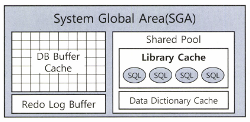

# 1.2 SQL 공유 및 재사용

소프트 파싱과 하드 파싱의 차이점을 설명한다. 

## 1.2.1 소프트 파싱 vs 하드 파싱



- SGA(System Global Area) : 서버 프로세스와 백그라운드 프로세스가 공통으로 액세스하는 데이터와 제어 구조를 캐싱하는 메모리 공간
- 라이브러리 캐시 : SGA의 구성요소로 생성한 내부 프로시저를 반복 재사용할 수 있도록 캐싱해두는 메모리 공간
- SQL을 DBMS에 전달하면 DBMS는 SQL을 파싱한 후 SQL이 라이브러리 캐시에 존재하는지부터 확인한다.


- 소프트 파싱 : SQL을 캐시에서 찾아 곧바로 실행
- 하드 파싱 : SQL을 캐시에서 찾는 데 실패해 최적화 및 로우 소스 생성 단계까지 모두 거쳐 실행

### SQL 최적화 과정은 왜 Hard 한가

- 옵티마이저가 SQL 최적화를 하면서 사용하는 정보는 다음과 같다.
    - 테이블, 컬럼, 인덱스 구조에 관한 기본 정보
    - 오브젝트 통계 : 테이블 통계, 인덱스 통계, (히스토그램을 포함한) 컬럼 통계
    - 시스템 통계 : CPU 속도, Single Block I/O 속도, Multiblock I/O 속도 등
    - 옵티마이저 관련 파라미터
- 실행경로를 도출하고 딕셔너리와 통계정보를 읽어 각각에 대한 효율성을 판단하는 과정은 가벼울 수 없다. 데이터베이스에서의 처리 과정은 대부분 I/O 작업에 집중되는 반면, 하드 파싱은 CPU를 많이 소비하는 몇 안되는 작업 중 하나다.
- 이렇게 생성한 내부 프로시저를 한번만 사용하고 버린다면 비효율적이므로 라이브러리 캐시가 필요한 것이다.

## 1.2.2 바인드 변수의 중요성

### 이름없는 SQL 문제

- 사용자 정의 함수/프로시저, 트리거, 패키지 등은 생성할 때 명명하고 컴파일한 상태로 딕셔너리에 저장되며, 실행할 때 라이브러리 캐시에 적재함으로써 여러 사용자가 공유하고 재사용한다.
- SQL은 명명하지 않으며, 딕셔너리에 저장하지도 않고, 실행 할 때 최적화 과정을 거쳐 생성한 내부 프로시저를 라이브러리 캐시에 적재함으로써 여러 사용자가 공유되고 재사용한다.
- 모든 SQL을 저장할 수 없기 때문에 DBMS는 SQL을 영구 저장하지 않는 쪽을 선택했다.

### 공유 가능 SQL

- 아래는 모두 의미적으로는 갖거나 유사하지만 모두 다른 SQL이다.

```sql
SELECT * FROM emp WHERE empno = 7000;
selet * from EMP where EMPNO = 7900;
select * from emp where empno = 7900;
select * from emp where empno = 7900 ;
select * from customer where login_id = 'oraking'
select * from customer where login_id = 'javaking'
...
```

- 하지만 내부 처리 루틴은 같으므로 내부 프로시저를 여러 개 생성할 것이 아니라 로그인ID를 파라미터로 받는 프로시저 하나를 공유하면서 재사용하는 것이 마땅하다.
- 이처럼 파라미터 Driven 방식으로 SQL을 작성하는 방법이 제공되는데, 바인드 변수가 바로 그것이다.
- 라이브러리 캐시를 조회하면 로그인과 관련해서 아래 SQL 하나만 발견된다.

```sql
SELECT * FROM CUSTOMER WHERE LOGIN_ID = :1
```

- 이 SQL에 대한 하드파싱은 최초 한번만 일어나고 캐싱된 SQLdmf 100만 고객이 공유하면서 재사용한다.
